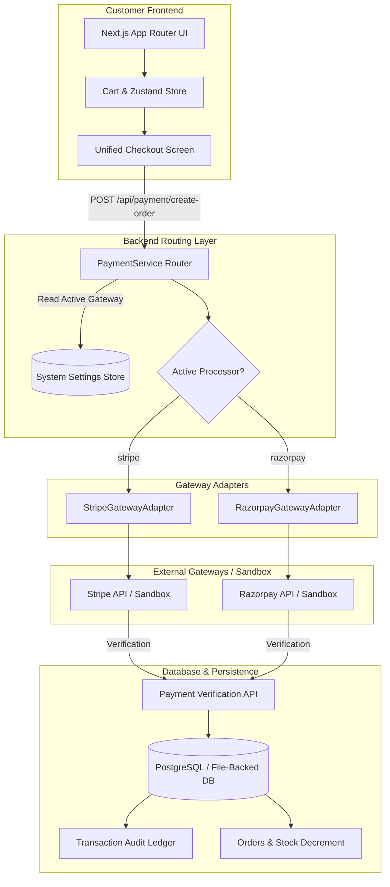

# VegiMart × Suvidha — Full-Stack E-Commerce Platform

[](https://nextjs.org/)
[](https://react.dev/)
[](https://www.typescriptlang.org/)
[](https://tailwindcss.com/)
[](https://www.docker.com/)
[](https://www.postgresql.org/)

> **VegiMart × Suvidha**: A modern, mobile-first e-commerce fresh produce and grocery delivery platform inspired by Australian IGA stores and Suvidha Cafe specialties. Featuring an **intelligent dual payment gateway backend (Stripe & Razorpay)** with real-time admin switching, audit trail logging, and seamless checkout.

---

## 🚀 Key Features

### 1. Dual Payment Gateway Architecture
- **Unified Checkout Experience**: Customers enjoy the identical frictionless checkout UI regardless of backend gateway.
- **Dynamic Processor Dispatching**:
  - **Option A (Stripe)**: Cards (Visa, MasterCard, Amex), Apple Pay, Google Pay via PaymentIntents.
  - **Option B (Razorpay)**: UPI (GPay, PhonePe, Paytm), NetBanking, and Cards with HMAC SHA256 signature verification.
- **Interactive Sandbox Mode**: Instant one-click test card and test UPI autofill for rapid QA and demonstration without requiring production API credentials.
- **Transaction Audit Ledger**: Records each order's specific gateway (`stripe` vs `razorpay`), amount, transaction ID, payment method, and timestamps.
- **Webhook Subsystem**: Synchronous verification and asynchronous listeners (`/api/webhooks/stripe`, `/api/webhooks/razorpay`) with an admin webhook simulator.

### 2. Australian IGA Produce & Suvidha Cafe Storefront
- **Fresh Produce**: Australian Pink Lady Apples, Cavendish Bananas, Hass Avocados, Crisp Broccoli, Sourdough Bread, Gippsland Milk, and Farm Eggs.
- **Suvidha Specialties**: Hot handmade samosas, aged Himalayan basmati rice, artisan malai paneer, pure desi ghee, and royal cardamom masala chai.
- **Catalog Filtering & Search**: Instant autocomplete search, category filters, price sliders, dietary filters (Organic), and grid/list view toggles.
- **Product Details**: Origin tracking, freshness badges, serving nutrition breakdowns, verified reviews, and pair recommendations.
- **Shopping Basket & Delivery Slots**: Promo code engine (`FRESH10` for $10 off, `SUVIDHA` for free delivery, `WELCOME` for 15% off), delivery slot selection (Morning 8-11am, Afternoon 1-4pm, Evening 5-8pm), and fee breakdown.
- **Order Confirmation & Invoicing**: Celebratory confetti, gateway transaction verification badge, and printable itemized tax invoices.

### 3. Comprehensive Admin Control Center
- **Admin Hub** (`/admin`): Revenue analytics, order metrics with period filter (Today, This Week, This Month, All Time), low-stock watchlist, and gateway quick toggle.
- **Payment Gateway Manager** (`/admin/payments`): Live gateway switcher, credentials configuration, webhook monitor with test dispatchers, and filterable transaction ledger.
- **Inventory Station** (`/admin/products`): Full CRUD, inline stock editor, and CSV export.
- **Fulfillment & Packing** (`/admin/orders`): Order pipeline updates, printable warehouse packing slips, and printable **Courier Shipping Labels** with simulated barcodes.

---

## 🏛️ System Architecture



---

## 🛠️ Tech Stack

- **Framework**: [Next.js 14+ / 16](https://nextjs.org/) (App Router, Server Components & Server Actions)
- **Language**: TypeScript 5
- **Styling**: Tailwind CSS v4 (Custom brand palette: Forest Green `#1B5E20`, Vibrant Orange `#FF6F00`, Lime Green `#7CB342`)
- **Typography**: Google Fonts (Outfit headings + Inter body)
- **State Management**: Zustand (Local storage persistence)
- **Icons & UI**: Lucide React, Canvas Confetti
- **Database**: PostgreSQL 16 (Prisma ORM) with hybrid atomic JSON storage fallback
- **Containerization**: Docker multi-stage build + Docker Compose

---

## 📦 Quick Start & Local Setup

### Prerequisites
- Node.js 18+ or 20+
- npm (or yarn / pnpm)

### Installation

```bash
# 1. Clone the repository
git clone <repository-url>
cd savingmartxsuvidha

# 2. Install dependencies
npm install

# 3. Seed product catalog & initial settings
npm run db:seed

# 4. Start development server
npm run dev
```

Open [http://localhost:3000](http://localhost:3000) in your browser.

---

## 🐳 Running with Docker & PostgreSQL

To run the complete production stack (Next.js app + PostgreSQL 16 container):

```bash
# 1. Configure environment
cp .env.example .env

# 2. Build and launch containers
docker compose up -d --build

# 3. Seed the catalog in container
docker compose exec web npm run db:seed
```

Access:
- Web Storefront: `http://localhost:3000`
- Admin Gateway Switcher: `http://localhost:3000/admin/payments`
- PostgreSQL: `localhost:5432` (User: `vegimart_admin`, DB: `vegimart_db`)

---

## 🔄 How to Switch Payment Gateways

1. Navigate to **[http://localhost:3000/admin/payments](http://localhost:3000/admin/payments)**.
2. Click **"Switch to Razorpay"** or **"Switch to Stripe"**.
3. A confirmation notification will appear.
4. Visit the Storefront, add items to cart, and proceed to **[Checkout](http://localhost:3000/checkout)**.
5. Notice that the checkout dynamically displays the active gateway badge ("Routed via Stripe" or "Routed via Razorpay") and adjusts the payment elements seamlessly.
6. Complete the checkout with the one-click test credentials.
7. Return to the Admin Payment Dashboard to see the transaction logged in the audit ledger with the exact gateway tag.

---

## 📖 API Documentation & Postman

- **OpenAPI 3.0 Specification**: [`docs/openapi.yaml`](docs/openapi.yaml)
- **Postman Collection**: Import [`docs/VegiMart-Suvidha.postman_collection.json`](docs/VegiMart-Suvidha.postman_collection.json) into Postman to test:
  - Catalog retrieval & filtering
  - Order creation with active gateway
  - Stripe and Razorpay payment verification
  - Webhook simulation
  - Admin gateway switching

---

## 🔒 Security & Performance Features

- **HTTP Security Headers**: HSTS, `X-Frame-Options: SAMEORIGIN`, `X-Content-Type-Options: nosniff`, `Referrer-Policy: strict-origin-when-cross-origin`, `Permissions-Policy`.
- **API Rate Limiting**: Token-bucket sliding window rate limiter (`src/lib/rate-limit.ts`) protecting order and payment endpoints.
- **PWA Ready**: Web App Manifest (`public/manifest.json`) supporting standalone mobile installation.
- **Sanitized Audit Trail**: Sensitive credentials masked in API responses; transaction references and webhook events persisted for complete PCI auditability.

---

## 📄 License
Registered Australian Business. Copyright © 2026 VegiMart × Suvidha. All rights reserved.
